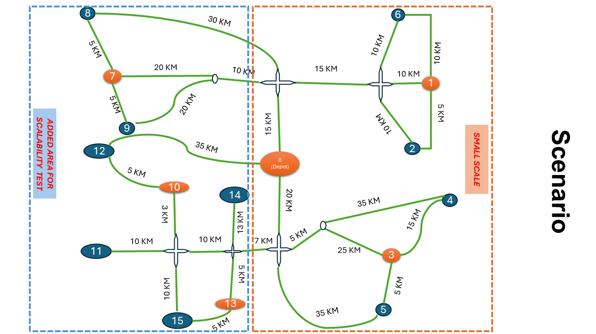
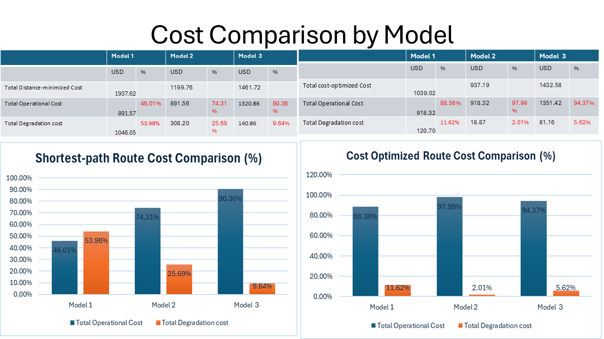
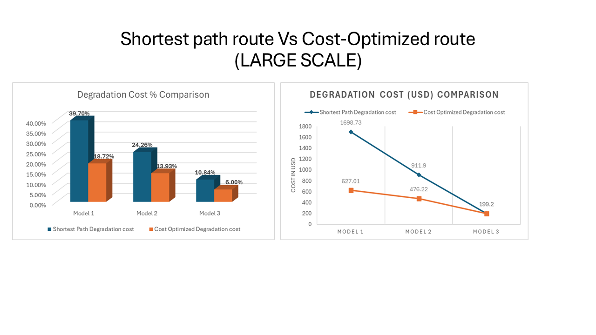
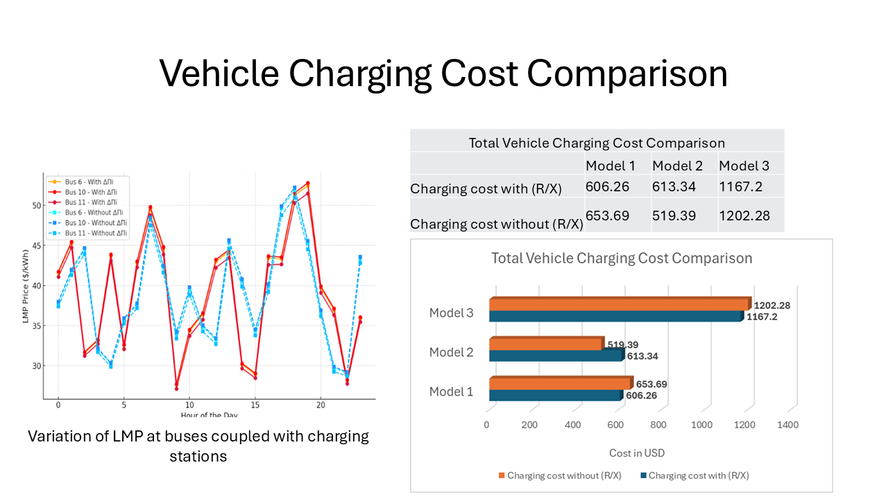
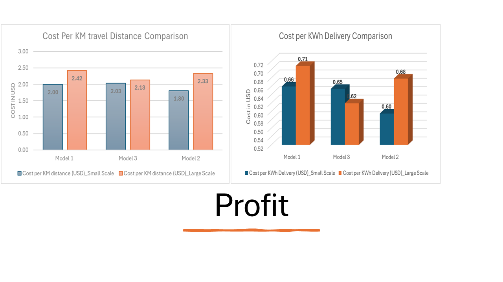

# Optimal Mobile Energy Transportation: A Co-Optimization Approach

This repository contains a framework for optimizing mobile energy storage systems (MESS) transportation routes using dynamic programming. The framework integrates sector coupling between transportation and electricity networks to enhance overall operational efficiency.

## Features

- **Traffic-aware and terrain-sensitive routing**: Incorporating real-time traffic data and terrain gradients
- **Battery degradation modeling**: Using empirical battery degradation models to account for battery lifecycle costs
- **Locational Marginal Pricing (LMP)**: Dynamic pricing based on grid conditions
- **Co-optimization approach**: Simultaneously optimizing travel routes, traffic constraints, battery degradation, and charging costs

## Repository Structure

```
├── CSS/                    # Contains optimization model notebooks
│   ├── Model1_SmallScale.ipynb
│   ├── Model1_LargeScale.ipynb
│   ├── Model2_SmallScale.ipynb
│   ├── Model2_LargeScale.ipynb
│   ├── Model3_SmallScale.ipynb
│   └── Model3_LargeScale.ipynb
├── Dataset/                # Contains input data for the models
├── Analysis/ 		    # Stores analysis results and visualizations
├── normalize_notebooks.py               
├── config.py               # Configuration file for dataset paths
├── main.py                 # Main script for running the optimization models
└── run.ipynb               # Jupyter notebook interface for running the models
```

## Models

The repository includes six optimization models based on different battery chemistries:

1. **Model 1**: Using Nickel Manganese Cobalt Oxide (NMC) battery degradation model
   - Focuses solely on cyclic aging, excluding calendar aging effects
   - Suitable for applications where cycle life is the primary concern

2. **Model 2**: Using Lithium Iron Phosphate (LFP) battery degradation model
   - Considers both calendar and cyclic aging effects
   - More comprehensive than the NMC model where degradation is isolated to cyclic stress

3. **Model 3**: Using a Generalized battery degradation model
   - Incorporates the impact of Depth of Discharge (DoD) on degradation cost per cycle
   - Adaptable across different lithium-ion chemistries

## Transportation Network Scenario

The framework is tested on both small-scale and large-scale transportation networks:



The transportation network includes:
- Depot (Node 0): Starting point for all mobile energy storage vehicles
- Charging sites (orange nodes): Locations where MESS can recharge
- Construction sites (blue nodes): Locations with excavators that need energy from MESS
- Small-scale network: 7 nodes (right section)
- Large-scale network: 16 nodes (full network)

The links between nodes represent roads with distances marked in kilometers. The framework considers real-world constraints such as traffic conditions, road gradients, battery degradation and time-dependent pricing when optimizing routes.

## Getting Started

### Usage

#### Option 1: Using the Jupyter Notebook Interface

1. Open `run.ipynb` in Jupyter Notebook:
   ```
   jupyter notebook run.ipynb
   ```

2. Follow the instructions in the notebook to run a specific optimization model and view results.

#### Option 2: Using the Command Line

1. Run the main script:
   ```
   python main.py
   ```

2. Follow the prompts to select and run a specific optimization model.

## Troubleshooting

### Missing ID Field Warning

If you see warnings about "Cell is missing an id field", this is related to older notebook formats. You can fix this by running:

```
python normalize_notebooks.py
```

This will normalize all notebook files in the CSS folder and add the required ID fields.

## Results and Analysis

The framework produces comprehensive analyses comparing the performance of different battery degradation models and routing strategies.

### 1. Shortest Path vs. Cost-Optimized Route Comparison



This analysis compares the traditional shortest path routing with our cost-optimized approach for small-scale scenarios. Key findings:
- Cost-optimized routes significantly reduce battery degradation costs
- While operational costs remain similar between approaches, degradation costs show dramatic differences
- The total system cost is consistently lower with the cost-optimized approach across all models

### 2. Large-Scale Implementation Results



Extending the analysis to large-scale networks shows:
- Consistent patterns of degradation cost reduction through cost-optimized routing
- Model 1 (NMC) shows the highest potential for degradation cost reduction
- Model 3 (Generalized) demonstrates the smallest gap between routing approaches, suggesting greater resistance to route-dependent degradation

### 3. Vehicle Charging Cost Analysis



LMP-based charging cost analysis reveals:
- Significant hourly variations in charging costs across different bus locations
- Strategic charging with optimal time selection (R/X) consistently reduces costs across all models
- Model 3 shows the highest charging costs, likely due to its more complex degradation model accounting for deeper DoD cycles

### 4. Cost Efficiency Metrics



Evaluation of key cost efficiency metrics shows:
- Large-scale implementations have higher per-kilometer costs across all models
- Model 3 demonstrates the lowest cost per kWh delivery in both small and large-scale scenarios
- The cost-optimized approach consistently outperforms distance-minimized routing in terms of cost per kWh delivered


The results demonstrate that considering battery degradation in routing decisions can lead to significant cost savings.
